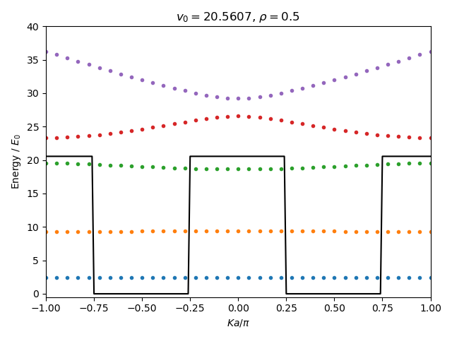

# ExtendedKronigPennyMatrix

Construct a numerical Hamiltonian matrix of Kronig-Penny model 
extended to arbitrary potentials 
based on the paper written by Pavelich and Marsiglio.

> R. L. Pavelicha and F. Marsigliob, 
> "The Kronig-Penney model extended to arbitrary potentials via numerical matrix mechanics," American Journal of Physics 83, 774 (2015). 
> [DOI:10.1119/1.4923026](https://doi.org/10.1119/1.4923026), 
> [ResearchGate](https://www.researchgate.net/publication/268227429_The_Kronig-Penney_model_extended_to_arbitrary_potentials_via_numerical_matrix_mechanics)

